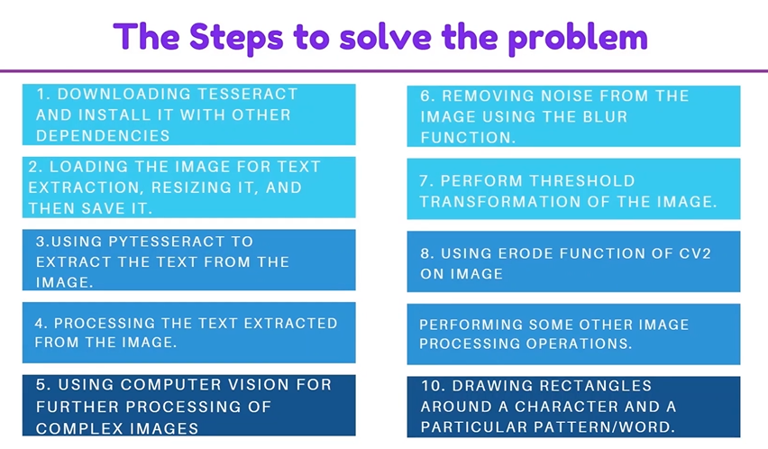
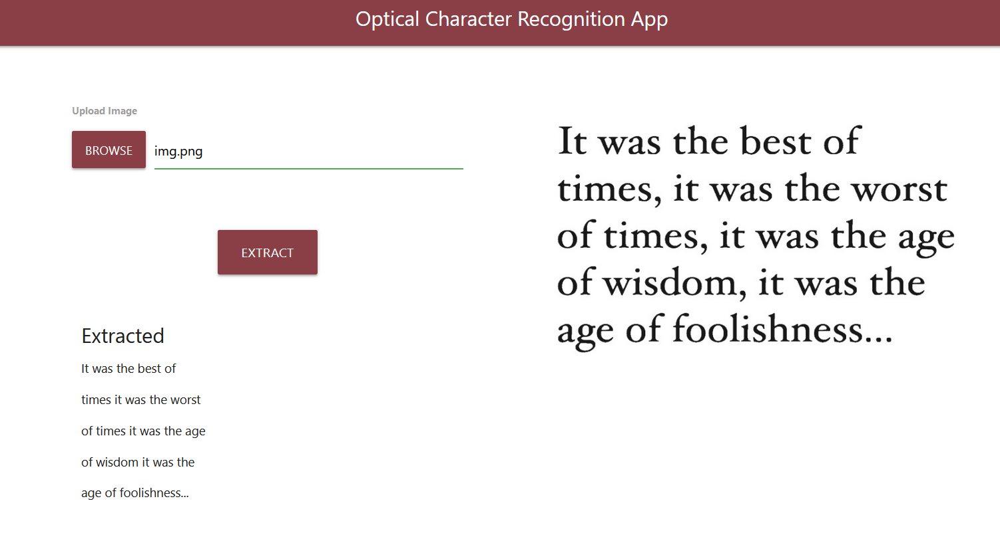

In this project, we have worked on extracting text from images. After extracting the text we have applied some basic functions of OpenCV on that text to enhance it and to get more accurate results. This project will be very useful as it will save time and effort of typing from an image.

# Installation

- 1 - create a virtual environment and activate
- 2 - pip install virtualenv
- - virtualenv envname
- - envname\scripts\activate
- 3 - cd into project
- 4 - pip install -r requirements.txt
- 5 - Install tesseract using windows installer available at: https://github.com/UB-Mannheim/tesseract/wiki
      Note the tesseract path from the installation. Default installation path at the time of this edit was: C:\ProgramFiles\Tesseract-OCR. It may change so please check the installation path. Add the path in the the path section in environment variables.
- 6 - py app.py

# Steps

# HomePage

